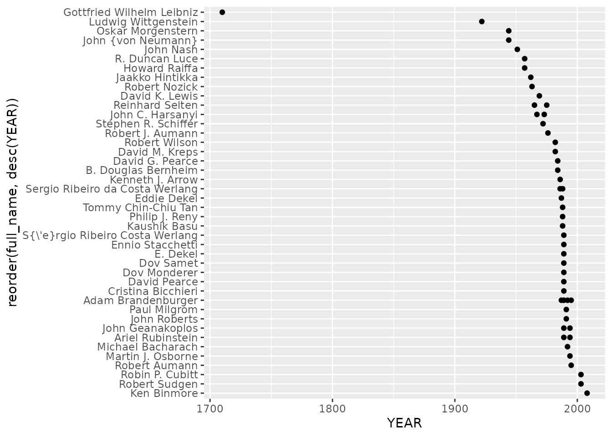

# bib2df - Parse a BibTeX file to a data.frame

## BibTeX

BibTeX is typically used together with LaTeX to manage references. The
BibTeX file format is simple as it follows rather simple but strict
rules and represents a reference’s core data as a list of partly
mandatory fields.

The resulting BibTeX file can tell much about the work you use it for,
may it be an academic paper, a dissertation or any other report that at
least partly appoints to the work of others. The average age of the
referenced works might tell if one addresses to a current topic or if
one digs into the history of a certain field. Does one cite many works
of just a few authors or occurs every author at most once? The BibTeX
file is definitely able to answer these questions.

## Why bib2df?

As mentioned above, BibTeX represents the entries as lists of named
fields, some kind of similar to the `JSON` format. If you want to gain
insights from your BibTeX file using R, you will have to transform the
data to fit into a more usual data structure. Such a data structure,
speaking of R, is the `tibble`. `bib2df` does exactly this: It takes a
BibTeX file and parses it into a `tibble` so you can work with your
bibliographic data just the way you do with other data.

Given this `tibble` you can manipulate entries in a familiar way and
write the updated references back to a valid BibTeX file.

## How to use

### Parse the BibTeX file

To parse a BibTeX file to a `tibble` you may want to use the function
[`bib2df()`](https://docs.ropensci.org/bib2df/reference/bib2df.md). The
first argument of
[`bib2df()`](https://docs.ropensci.org/bib2df/reference/bib2df.md) is
the path to the file you want to parse.

``` r

install.packages("bib2df")
```

``` r

library(bib2df)

path <- system.file("extdata", "LiteratureOnCommonKnowledgeInGameTheory.bib", package = "bib2df")

df <- bib2df(path)
df
```

    ## # A tibble: 37 × 27
    ##    CATEGORY   BIBTEXKEY ADDRESS ANNOTE AUTHOR BOOKTITLE CHAPTER CROSSREF EDITION
    ##    <chr>      <chr>     <chr>   <chr>  <list> <chr>     <chr>   <chr>    <chr>  
    ##  1 ARTICLE    Arrow1986 NA      NA     <chr>  NA        NA      NA       NA     
    ##  2 ARTICLE    AumannBr… NA      NA     <chr>  NA        NA      NA       NA     
    ##  3 ARTICLE    Aumann19… NA      NA     <chr>  NA        NA      NA       NA     
    ##  4 INCOLLECT… Bacharac… Cambri… NA     <chr>  Knowledg… 17      NA       NA     
    ##  5 ARTICLE    Basu1988  NA      NA     <chr>  NA        NA      NA       NA     
    ##  6 ARTICLE    Bernheim… NA      NA     <chr>  NA        NA      NA       NA     
    ##  7 ARTICLE    Bicchier… NA      NA     <chr>  NA        NA      NA       NA     
    ##  8 ARTICLE    Binmore2… NA      NA     <chr>  NA        NA      NA       NA     
    ##  9 ARTICLE    Brandenb… NA      NA     <chr>  NA        NA      NA       NA     
    ## 10 INCOLLECT… Brandenb… New Yo… NA     <chr>  The Econ… 3       NA       NA     
    ## # ℹ 27 more rows
    ## # ℹ 18 more variables: EDITOR <list>, HOWPUBLISHED <chr>, INSTITUTION <chr>,
    ## #   JOURNAL <chr>, KEY <chr>, MONTH <chr>, NOTE <chr>, NUMBER <chr>,
    ## #   ORGANIZATION <chr>, PAGES <chr>, PUBLISHER <chr>, SCHOOL <chr>,
    ## #   SERIES <chr>, TITLE <chr>, TYPE <chr>, VOLUME <chr>, YEAR <dbl>, DOI <chr>

[`bib2df()`](https://docs.ropensci.org/bib2df/reference/bib2df.md)
returns a `tibble` with each row representing one entry of the initial
BibTeX file while the columns hold the data originally stored in the
named fields. If a field was not present in a particular entry, the
respective column gets the value `NA`. As some works can be the work of
multiple authors or editors, these fields are converted to a list to
avoid having the names of multiple persons concatenated to a single
character string:

``` r

head(df$AUTHOR)
```

    ## [[1]]
    ## [1] "Arrow, Kenneth J."
    ## 
    ## [[2]]
    ## [1] "Aumann, Robert"      "Brandenburger, Adam"
    ## 
    ## [[3]]
    ## [1] "Aumann, Robert J."
    ## 
    ## [[4]]
    ## [1] "Bacharach, Michael"
    ## 
    ## [[5]]
    ## [1] "Basu, Kaushik"
    ## 
    ## [[6]]
    ## [1] "Bernheim, B. Douglas"

The second argument of
[`bib2df()`](https://docs.ropensci.org/bib2df/reference/bib2df.md) is
`separate_names` and calls, if `TRUE`, the functionality of the
`humaniformat` [^1] package to automatically split persons’ names into
pieces:

``` r

df <- bib2df(path, separate_names = TRUE)
head(df$AUTHOR)
```

    ## [[1]]
    ##   salutation first_name middle_name last_name suffix        full_name
    ## 1       <NA>    Kenneth          J.     Arrow   <NA> Kenneth J. Arrow
    ## 
    ## [[2]]
    ##   salutation first_name middle_name     last_name suffix          full_name
    ## 1       <NA>     Robert        <NA>        Aumann   <NA>      Robert Aumann
    ## 2       <NA>       Adam        <NA> Brandenburger   <NA> Adam Brandenburger
    ## 
    ## [[3]]
    ##   salutation first_name middle_name last_name suffix        full_name
    ## 1       <NA>     Robert          J.    Aumann   <NA> Robert J. Aumann
    ## 
    ## [[4]]
    ##   salutation first_name middle_name last_name suffix         full_name
    ## 1       <NA>    Michael        <NA> Bacharach   <NA> Michael Bacharach
    ## 
    ## [[5]]
    ##   salutation first_name middle_name last_name suffix    full_name
    ## 1       <NA>    Kaushik        <NA>      Basu   <NA> Kaushik Basu
    ## 
    ## [[6]]
    ##   salutation first_name middle_name last_name suffix           full_name
    ## 1       <NA>         B.     Douglas  Bernheim   <NA> B. Douglas Bernheim

### Parsing multiple BibTex files

Multiple BibTeX files can be parsed using
[`lapply()`](https://rdrr.io/r/base/lapply.html). The paths to the
BibTeX files must be stored in a vector. Using this vector to call
[`bib2df()`](https://docs.ropensci.org/bib2df/reference/bib2df.md)
within [`lapply()`](https://rdrr.io/r/base/lapply.html) results in a
list of `tibble`, which can be bound, e.g. using
[`bind_rows()`](https://dplyr.tidyverse.org/reference/bind_rows.html):

``` r

bib1 <- system.file("extdata", "LiteratureOnCommonKnowledgeInGameTheory.bib", package = "bib2df")
bib2 <- system.file("extdata", "r.bib", package = "bib2df")
paths <- c(bib1, bib2)

x <- lapply(paths, bib2df)
class(x)
```

    ## [1] "list"

``` r

head(x)
```

    ## [[1]]
    ## # A tibble: 37 × 27
    ##    CATEGORY   BIBTEXKEY ADDRESS ANNOTE AUTHOR BOOKTITLE CHAPTER CROSSREF EDITION
    ##    <chr>      <chr>     <chr>   <chr>  <list> <chr>     <chr>   <chr>    <chr>  
    ##  1 ARTICLE    Arrow1986 NA      NA     <chr>  NA        NA      NA       NA     
    ##  2 ARTICLE    AumannBr… NA      NA     <chr>  NA        NA      NA       NA     
    ##  3 ARTICLE    Aumann19… NA      NA     <chr>  NA        NA      NA       NA     
    ##  4 INCOLLECT… Bacharac… Cambri… NA     <chr>  Knowledg… 17      NA       NA     
    ##  5 ARTICLE    Basu1988  NA      NA     <chr>  NA        NA      NA       NA     
    ##  6 ARTICLE    Bernheim… NA      NA     <chr>  NA        NA      NA       NA     
    ##  7 ARTICLE    Bicchier… NA      NA     <chr>  NA        NA      NA       NA     
    ##  8 ARTICLE    Binmore2… NA      NA     <chr>  NA        NA      NA       NA     
    ##  9 ARTICLE    Brandenb… NA      NA     <chr>  NA        NA      NA       NA     
    ## 10 INCOLLECT… Brandenb… New Yo… NA     <chr>  The Econ… 3       NA       NA     
    ## # ℹ 27 more rows
    ## # ℹ 18 more variables: EDITOR <list>, HOWPUBLISHED <chr>, INSTITUTION <chr>,
    ## #   JOURNAL <chr>, KEY <chr>, MONTH <chr>, NOTE <chr>, NUMBER <chr>,
    ## #   ORGANIZATION <chr>, PAGES <chr>, PUBLISHER <chr>, SCHOOL <chr>,
    ## #   SERIES <chr>, TITLE <chr>, TYPE <chr>, VOLUME <chr>, YEAR <dbl>, DOI <chr>
    ## 
    ## [[2]]
    ## # A tibble: 1 × 27
    ##   CATEGORY BIBTEXKEY ADDRESS    ANNOTE AUTHOR BOOKTITLE CHAPTER CROSSREF EDITION
    ##   <chr>    <chr>     <chr>      <chr>  <list> <chr>     <chr>   <chr>    <chr>  
    ## 1 MANUAL   NA        Vienna, A… NA     <chr>  NA        NA      NA       NA     
    ## # ℹ 18 more variables: EDITOR <list>, HOWPUBLISHED <chr>, INSTITUTION <chr>,
    ## #   JOURNAL <chr>, KEY <chr>, MONTH <chr>, NOTE <chr>, NUMBER <chr>,
    ## #   ORGANIZATION <chr>, PAGES <chr>, PUBLISHER <chr>, SCHOOL <chr>,
    ## #   SERIES <chr>, TITLE <chr>, TYPE <chr>, VOLUME <chr>, YEAR <dbl>, URL <chr>

``` r

res <- dplyr::bind_rows(x)
class(res)
```

    ## [1] "tbl_df"     "tbl"        "data.frame"

``` r

head(res)
```

    ## # A tibble: 6 × 28
    ##   CATEGORY    BIBTEXKEY ADDRESS ANNOTE AUTHOR BOOKTITLE CHAPTER CROSSREF EDITION
    ##   <chr>       <chr>     <chr>   <chr>  <list> <chr>     <chr>   <chr>    <chr>  
    ## 1 ARTICLE     Arrow1986 NA      NA     <chr>  NA        NA      NA       NA     
    ## 2 ARTICLE     AumannBr… NA      NA     <chr>  NA        NA      NA       NA     
    ## 3 ARTICLE     Aumann19… NA      NA     <chr>  NA        NA      NA       NA     
    ## 4 INCOLLECTI… Bacharac… Cambri… NA     <chr>  Knowledg… 17      NA       NA     
    ## 5 ARTICLE     Basu1988  NA      NA     <chr>  NA        NA      NA       NA     
    ## 6 ARTICLE     Bernheim… NA      NA     <chr>  NA        NA      NA       NA     
    ## # ℹ 19 more variables: EDITOR <list>, HOWPUBLISHED <chr>, INSTITUTION <chr>,
    ## #   JOURNAL <chr>, KEY <chr>, MONTH <chr>, NOTE <chr>, NUMBER <chr>,
    ## #   ORGANIZATION <chr>, PAGES <chr>, PUBLISHER <chr>, SCHOOL <chr>,
    ## #   SERIES <chr>, TITLE <chr>, TYPE <chr>, VOLUME <chr>, YEAR <dbl>, DOI <chr>,
    ## #   URL <chr>

## Analyze and visualize your references

Since the BibTeX entries are now converted to rows and columns in a
`tibble`, one can start to analyze and visualize the data with common
tools like `ggplot2`, `dplyr` and `tidyr`.

For example, one can ask which journal is cited most among the
references

``` r

library(dplyr)
library(ggplot2)
library(tidyr)

df %>%
  filter(!is.na(JOURNAL)) %>%
  group_by(JOURNAL) %>%
  summarize(n = n()) %>%
  arrange(desc(n)) %>%
  slice(1:3)
```

    ## # A tibble: 3 × 2
    ##   JOURNAL                                  n
    ##   <chr>                                <int>
    ## 1 Econometrica                             4
    ## 2 Games and Economic Behavior              2
    ## 3 International Journal of Game Theory     2

or what the median age of the cited works is:

``` r

df %>%
  mutate(age = 2017 - YEAR) %>%
  summarize(m = median(age))
```

    ## # A tibble: 1 × 1
    ##       m
    ##   <dbl>
    ## 1    31

Also plotting is possible:

``` r

df %>% 
  select(YEAR, AUTHOR) %>% 
  unnest() %>% 
  ggplot() + 
  aes(x = YEAR, y = reorder(full_name, desc(YEAR))) + 
  geom_point()
```



## Manipulate your references

Since all the BibTeX entries are represented by rows in a `tibble`,
manipulating the BibTeX entries is now easily possible.

One of the authors of the 10th reference in our file does not have his
full first name:

``` r

df$AUTHOR[[10]]
```

    ##   salutation first_name middle_name     last_name suffix          full_name
    ## 1       <NA>       Adam        <NA> Brandenburger   <NA> Adam Brandenburger
    ## 2       <NA>         E.        <NA>         Dekel   <NA>           E. Dekel

The ‘E.’ in ‘E. Dekel’ is for Eddie, so lets change the value of that
field:

``` r

df$AUTHOR[[10]]$first_name[2] <- "Eddie"
df$AUTHOR[[10]]$full_name[2] <- "Eddie Dekel"

df$AUTHOR[[10]]
```

    ##   salutation first_name middle_name     last_name suffix          full_name
    ## 1       <NA>       Adam        <NA> Brandenburger   <NA> Adam Brandenburger
    ## 2       <NA>      Eddie        <NA>         Dekel   <NA>        Eddie Dekel

## Write back to BibTeX

Especially when single values of the parsed BibTeX file were changed it
is useful to write the parsed `tibble` back to a valid BibTeX file one
can use in combination with LaTeX. Just like
[`bib2df()`](https://docs.ropensci.org/bib2df/reference/bib2df.md)
parses a BibTeX file,
[`df2bib()`](https://docs.ropensci.org/bib2df/reference/df2bib.md)
writes a BibTeX file:

``` r

newFile <- tempfile()
df2bib(df, file = newFile)
```

The just written BibTeX file of course contains the values, we just
changed in the `tibble`:

    @Incollection{BrandenburgerDekel1989,
      Address = {New York},
      Author = {Brandenburger, Adam and Dekel, Eddie},
      Booktitle = {The Economics of Missing Markets, Information and Games},
      Chapter = {3},
      Pages = {46 - 61},
      Publisher = {Oxford University Press},
      Title = {The Role of Common Knowledge Assumptions in Game Theory},
      Year = {1989}
    }

To append BibTeX entries to an existing file use `append = TRUE` within
[`df2bib()`](https://docs.ropensci.org/bib2df/reference/df2bib.md).

[^1]: <https://CRAN.R-project.org/package=humaniformat>
